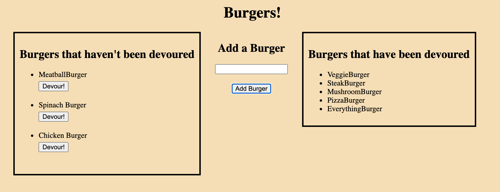

# Eat The Burger

## Description

"Eat The Burger" is a restaurant app that lets users input the names of burgers they'd like to eat.

Whenever a user submits a burger's name, the app will display the burger on the left side of the page -- waiting to be devoured.

Each burger in the waiting area also has a `Devour it!` button. When the user clicks it, the burger will move to the right side of the page.

## Table of Contents

* [Project Summary](#description)
* [Preview](#preview)
* [Deployed App](#app)
* [Contact Me](#questions)
  
## Preview

Below are some example images of the deployed app!

## App

Here is a link to the deployed app on Heroku: 
[Eat The Burger App](https://easy-burger-eatery.herokuapp.com/)

## Questions?

If you have any questions, please don't hesitate to reach out!

Github: [habby-bit](https://github.com/habby-bit)
  
Email: [habbyolu@gmail.com](habbyolu@gmail.com)
